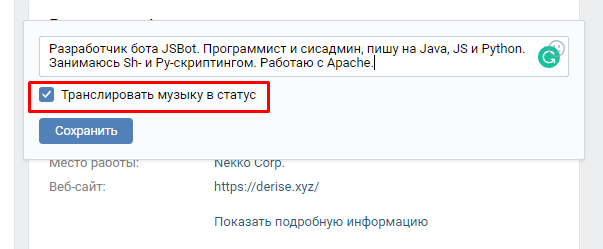
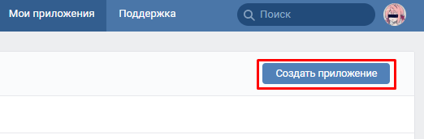
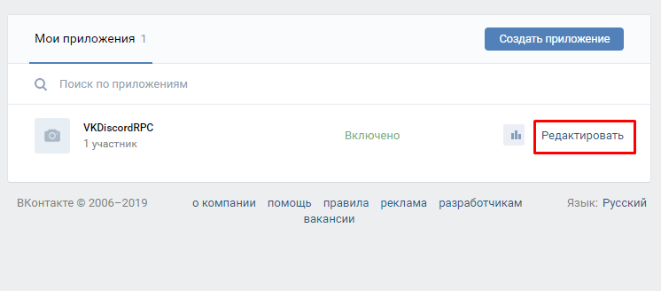
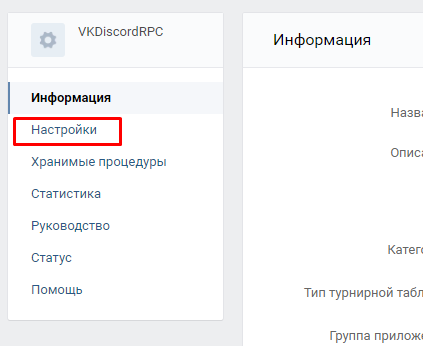
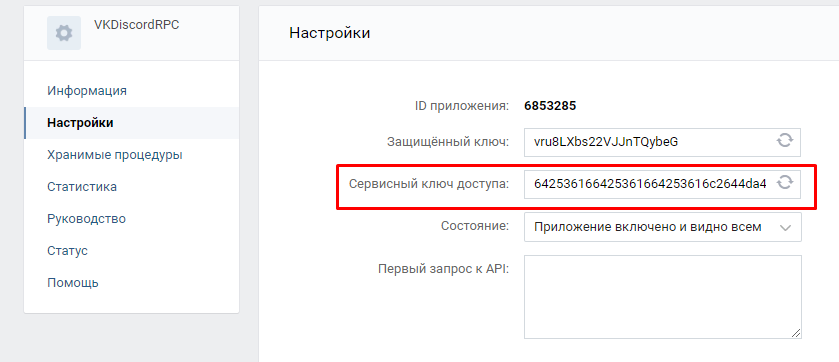
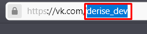
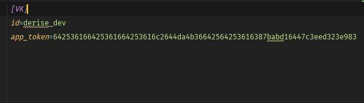
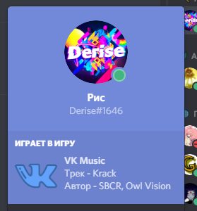

## Discord VK Music RPC
Отображение текущего трека из VK в профиле Discord

#### Инструкция

**_Подготовка:_**

`Все, что здесь написано является ОБЯЗАТЕЛЬНЫМ, и без этого приложение не будет работать`
1. В настройках статуса выставьте галочку "Транслировать музыку в статус"  
  
2. Создайте приложение по [этой ссылке](https://vk.com/apps?act=manage)  
  
3. Скопируйте сервисный ключ доступа и сохраните его где-нибудь, он нам еще понадобится  
  
  
  
4. Скопируйте вашу ссылку на страницу в ВК после vk.com (или же ваш ID) и сохраните её  
  
5. Отредактируйте файл config.ini (замените все на то, что написано). Пример (файл config_example.ini) -  
  
_id = Ваша короткая ссылка на страницу, которую мы получили в шаге номер 4_  
_app_token = Токен вашего приложения, который мы получили в шаге номер 3_  

**_Запуск:_**  
Windows:  
1. Установите [Python 3.7](https://www.python.org/ftp/python/3.7.2/python-3.7.2-amd64.exe)  
**`ВНИМАНИЕ - Поставьте галочку "Add to PATH"`**  
   
2. Запустите start.bat (если окно открывается и сразу закрывается - перезагрузите компьютер)

Linux:  
1. Установите Python 3.7 (команда для Debian-подобных систем: `sudo apt-get install python3.7`)  
2. Установите зависимости из requirements.txt (пример команды: `sudo pip3 install -r requirements.txt`)  
3. Выполните команду `python3 main.py` (если у вас несколько версий Python 3 - замените последнюю цифру на версию, которая позднее или является 3.6)  

Пример Rich Presence в профиле:  
